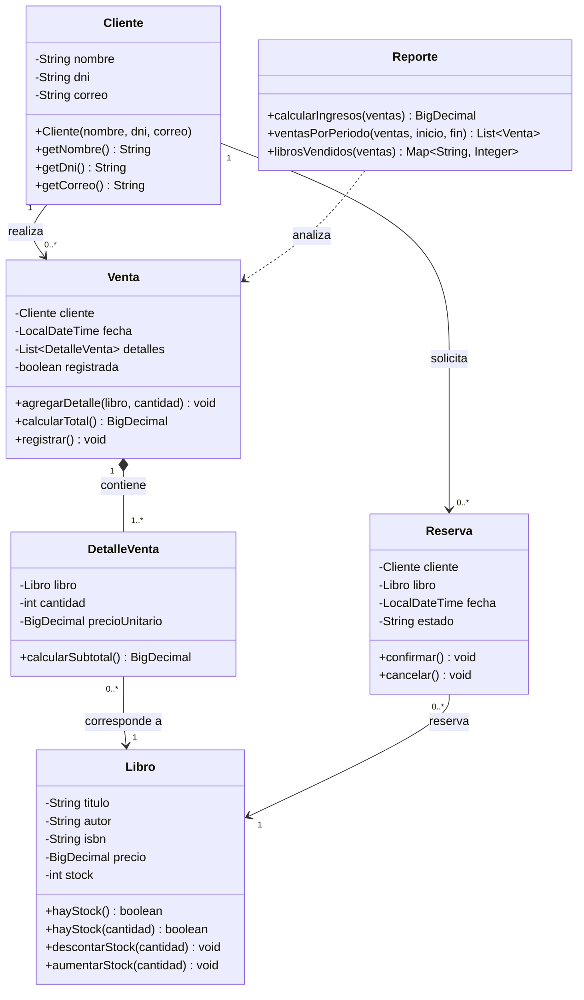

# Diagrama de clases UML — PageTurner

Este diagrama representa el modelo orientado a objetos de la librería académica
PageTurner. Las clases Java se encuentran en `src/pageturner`.

## Reglas del modelo

- Una venta se registra solo si todos sus libros tienen stock suficiente; al
  registrarse, el stock se descuenta automáticamente.
- Una reserva se crea únicamente para un libro cuyo stock sea cero.
- Los reportes usan las ventas registradas que se mantienen en memoria.
