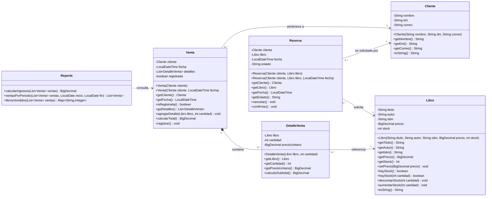

# Diagrama de clases de PageTurner

Este documento describe la estructura estática del dominio de PageTurner. El
diagrama corresponde a las clases ubicadas en `src/pageturner` y refleja sus
atributos, operaciones y relaciones actuales.

## Vista general

```mermaid
classDiagram
    direction LR

    class Cliente {
        -String nombre
        -String dni
        -String correo
        +Cliente(String nombre, String dni, String correo)
        +getNombre() String
        +getDni() String
        +getCorreo() String
        +toString() String
    }

    class Libro {
        -String titulo
        -String autor
        -String isbn
        -BigDecimal precio
        -int stock
        +Libro(String titulo, String autor, String isbn, BigDecimal precio, int stock)
        +getTitulo() String
        +getAutor() String
        +getIsbn() String
        +getPrecio() BigDecimal
        +getStock() int
        +setPrecio(BigDecimal precio) void
        +hayStock() boolean
        +hayStock(int cantidad) boolean
        +descontarStock(int cantidad) void
        +aumentarStock(int cantidad) void
        +toString() String
    }

    class Venta {
        -Cliente cliente
        -LocalDateTime fecha
        -List~DetalleVenta~ detalles
        -boolean registrada
        +Venta(Cliente cliente)
        +Venta(Cliente cliente, LocalDateTime fecha)
        +getCliente() Cliente
        +getFecha() LocalDateTime
        +isRegistrada() boolean
        +getDetalles() List~DetalleVenta~
        +agregarDetalle(Libro libro, int cantidad) void
        +calcularTotal() BigDecimal
        +registrar() void
    }

    class DetalleVenta {
        -Libro libro
        -int cantidad
        -BigDecimal precioUnitario
        +DetalleVenta(Libro libro, int cantidad)
        +getLibro() Libro
        +getCantidad() int
        +getPrecioUnitario() BigDecimal
        +calcularSubtotal() BigDecimal
    }

    class Reserva {
        -Cliente cliente
        -Libro libro
        -LocalDateTime fecha
        -String estado
        +Reserva(Cliente cliente, Libro libro)
        +Reserva(Cliente cliente, Libro libro, LocalDateTime fecha)
        +getCliente() Cliente
        +getLibro() Libro
        +getFecha() LocalDateTime
        +getEstado() String
        +cancelar() void
        +confirmar() void
    }

    class Reporte {
        +calcularIngresos(List~Venta~ ventas) BigDecimal
        +ventasPorPeriodo(List~Venta~ ventas, LocalDate inicio, LocalDate fin) List~Venta~
        +librosVendidos(List~Venta~ ventas) Map~String,Integer~
    }

    Venta "0..*" --> "1" Cliente : pertenece a
    Reserva "0..*" --> "1" Cliente : es solicitada por
    Venta "1" *-- "0..*" DetalleVenta : contiene
    DetalleVenta "0..*" --> "1" Libro : referencia
    Reserva "0..*" --> "1" Libro : solicita
    Reporte ..> Venta : consulta
```

## Leyenda UML

| Símbolo | Significado en el diagrama |
|---|---|
| `+` | Miembro público, accesible desde otras clases. |
| `-` | Miembro privado, accesible únicamente dentro de la clase. |
| `-->` | Asociación: una clase conserva una referencia a otra. |
| `*--` | Composición: el objeto contenido forma parte del objeto principal. |
| `..>` | Dependencia: una clase utiliza otra sin conservarla como atributo. |
| `1`, `0..*` | Cardinalidad: uno y cero o muchos, respectivamente. |

## Responsabilidad de cada clase

| Clase | Responsabilidad principal | Colaboradores |
|---|---|---|
| `Cliente` | Mantener los datos de la persona que compra o reserva. | `Venta`, `Reserva` |
| `Libro` | Conservar los datos bibliográficos, el precio y el inventario. | `DetalleVenta`, `Reserva` |
| `Venta` | Agrupar una compra, calcular su total y registrar el descuento de stock. | `Cliente`, `DetalleVenta`, `Libro` |
| `DetalleVenta` | Representar una cantidad de un libro y fijar su precio dentro de la venta. | `Venta`, `Libro` |
| `Reserva` | Representar la solicitud de un libro agotado y controlar su estado. | `Cliente`, `Libro` |
| `Reporte` | Consultar ventas registradas para producir indicadores. | `Venta`, `DetalleVenta` |
| `PageTurnerApp` | Crear datos y demostrar el modelo desde la consola. | Todas las clases del dominio |

`PageTurnerApp` no aparece en el diagrama porque es el punto de entrada de la
demostración, no una entidad del dominio.

## Explicación de las relaciones

### Venta, cliente y detalles

Cada `Venta` pertenece a exactamente un `Cliente`. Una venta compone de cero a
muchos objetos `DetalleVenta`: puede estar vacía mientras se prepara, pero debe
tener al menos un detalle para poder registrarse.

Los detalles se crean y administran desde `Venta`. El método `getDetalles()`
devuelve una vista no modificable, por lo que una clase externa no puede alterar
la colección directamente.

### Detalle de venta y libro

Cada `DetalleVenta` referencia un único `Libro`. Al crear el detalle se copia el
precio vigente del libro en `precioUnitario`; de esta manera, el subtotal de una
venta no cambia si el precio del libro se modifica posteriormente.

### Reserva, cliente y libro

Cada `Reserva` relaciona un `Cliente` con un `Libro`. La reserva solo puede
crearse cuando el libro está agotado. Su estado inicial es `PENDIENTE` y puede
cambiar mediante las operaciones `confirmar()` o `cancelar()`.

### Reporte y ventas

`Reporte` no almacena ventas. Recibe una lista en cada operación, filtra las que
están registradas y calcula el resultado solicitado. Por eso su relación con
`Venta` es una dependencia y no una asociación permanente.

## Invariantes y validaciones

- Los textos obligatorios no pueden ser nulos ni estar vacíos.
- El precio y el stock de un libro no pueden ser negativos.
- Las cantidades de inventario y de venta deben ser mayores que cero.
- Una venta registrada no puede modificarse ni registrarse otra vez.
- Antes de descontar inventario, `Venta` valida la cantidad acumulada de cada
  libro. Así evita un descuento parcial cuando un mismo libro aparece en varios
  detalles.
- Una reserva solo se crea para un libro sin stock.
- Una reserva solo se confirma cuando el libro vuelve a tener stock.
- La fecha final de un reporte no puede ser anterior a su fecha inicial.
- Los reportes ignoran las ventas que todavía no han sido registradas.

## Decisiones del modelo

- Se utiliza `BigDecimal` para evitar errores de precisión al operar con dinero.
- Se utiliza `LocalDateTime` para registrar el momento de ventas y reservas.
- Los datos viven únicamente en memoria; todavía no existe una capa de
  persistencia.
- El estado de `Reserva` se representa actualmente con un `String`. Una futura
  mejora podría reemplazarlo por un `enum` para restringir sus valores posibles.

Los procesos dinámicos del modelo se muestran en
[Flujos de negocio](flujos-negocio.md).
