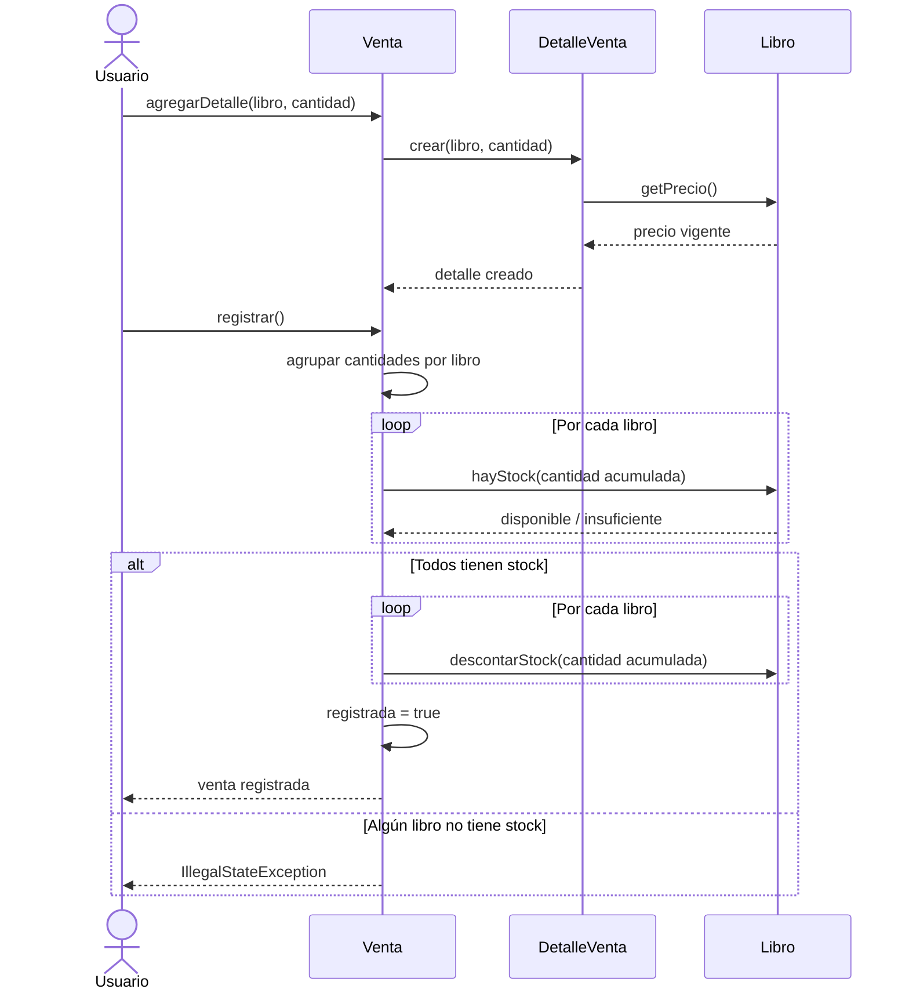
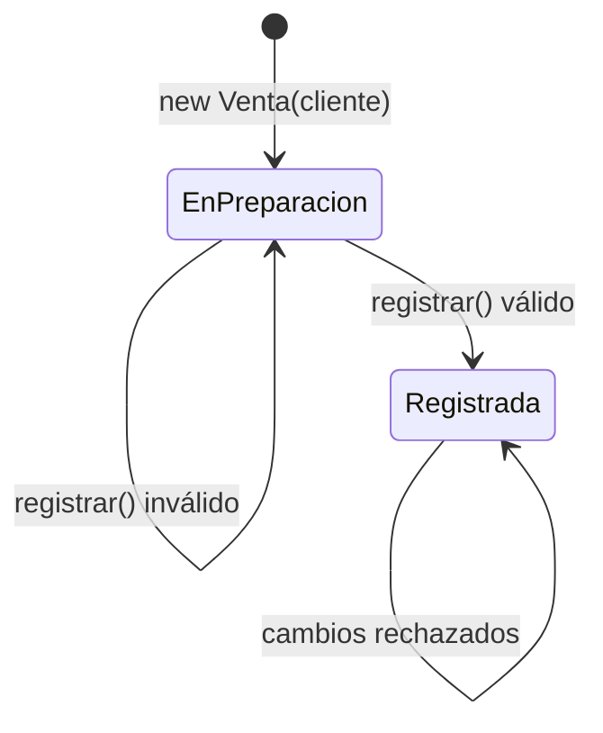
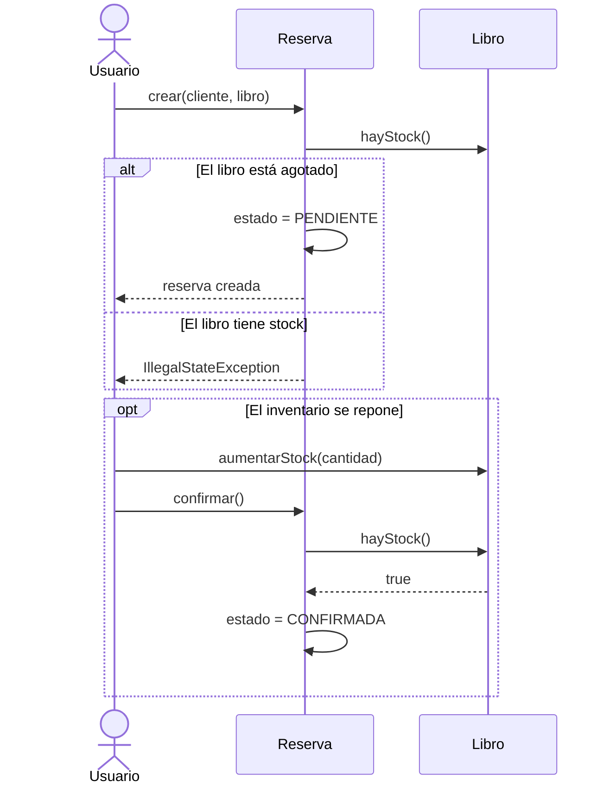
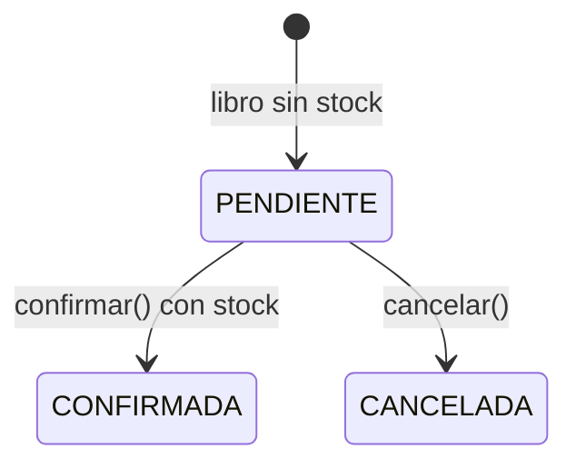
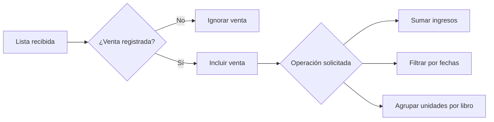

# Flujos de negocio de PageTurner

Este documento complementa el [diagrama de clases](diagrama-clases.md) mostrando
cómo colaboran los objetos durante las operaciones principales.

## Registro de una venta

La validación se completa para todos los libros antes de descontar unidades. Si
alguno no dispone de la cantidad requerida, el inventario permanece intacto.

## Ciclo de una venta

Una venta en preparación admite detalles. Después de registrarse queda cerrada:
ya no se pueden agregar productos ni volver a ejecutar `registrar()`.

## Creación y gestión de una reserva

## Estados de una reserva

El modelo actual no impide invocar `cancelar()` o `confirmar()` desde un estado
final. El diagrama representa el uso esperado; endurecer estas transiciones sería
una posible mejora futura.

## Generación de reportes

Las tres consultas de `Reporte` trabajan sobre la lista que reciben y no
modifican los objetos originales:

- `calcularIngresos()` suma el total de cada venta registrada.
- `ventasPorPeriodo()` incluye ambas fechas límite.
- `librosVendidos()` agrupa cantidades usando el título y el ISBN como etiqueta.

## Escenarios de error esperados

| Operación | Condición inválida | Resultado |
|---|---|---|
| Crear un libro | Precio o stock negativo | `IllegalArgumentException` |
| Agregar un detalle | Cantidad igual o menor que cero | `IllegalArgumentException` |
| Modificar una venta | La venta ya está registrada | `IllegalStateException` |
| Registrar una venta | No tiene detalles | `IllegalStateException` |
| Registrar una venta | Stock insuficiente | `IllegalStateException` |
| Crear una reserva | El libro todavía tiene stock | `IllegalStateException` |
| Confirmar una reserva | El libro sigue agotado | `IllegalStateException` |
| Consultar un periodo | La fecha final precede a la inicial | `IllegalArgumentException` |
